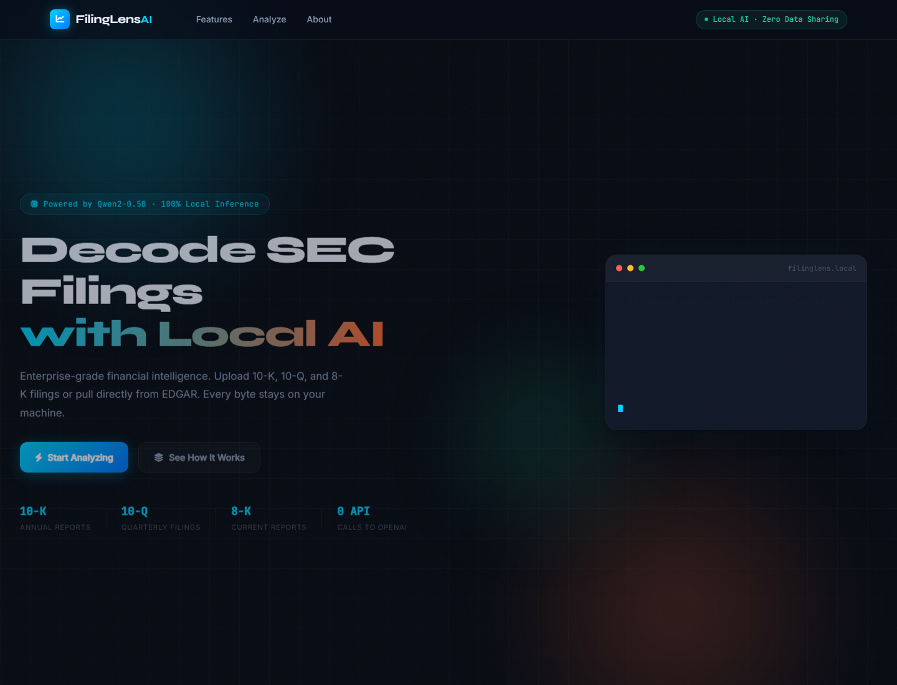

# App de sentimiento - FilingLens AI

Aplicacion web para analizar sentimiento en documentos financieros SEC (10-K, 10-Q y 8-K) usando Flask y un modelo local de HuggingFace.

## Demo en GitHub Pages

Vista estatica del frontend: https://samantha-ams.github.io/App-de-sentimiento/

> Nota: GitHub Pages no ejecuta Python, Flask ni modelos de IA. La demo publicada muestra la interfaz. Para usar el analisis real, ejecuta la app localmente con Flask.

## Captura de pantalla



## Caracteristicas

- Analisis de sentimiento Positive, Neutral o Negative.
- Carga de archivos `.txt`, `.html` y `.htm`.
- Consulta de filings desde SEC EDGAR por ticker.
- Procesamiento por chunks para documentos largos.
- Interfaz web con HTML, CSS y JavaScript.
- Backend local con Flask.

## Ejecutar localmente

```bash
git clone https://github.com/Samantha-ams/App-de-sentimiento.git
cd App-de-sentimiento
python -m venv venv
venv\Scripts\activate
pip install -r requirements.txt
python app.py
```

Abre http://localhost:5000 en tu navegador.

## Estructura importante

```text
app.py                  # Backend Flask y logica de analisis
requirements.txt        # Dependencias de Python
templates/index.html    # Plantilla Flask
static/                 # CSS y JavaScript de la app
docs/                   # Version estatica para GitHub Pages
docs/assets/preview.png # Captura usada en este README
uploads/.gitkeep        # Carpeta vacia para archivos cargados localmente
```

## Tecnologias

- Python
- Flask
- HuggingFace Transformers
- BeautifulSoup
- HTML, CSS y JavaScript
- GitHub Pages para la vista estatica
